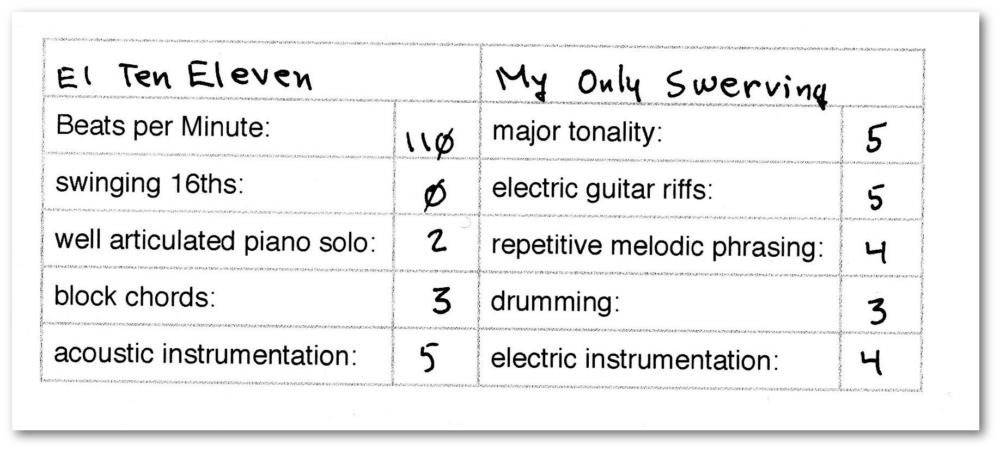
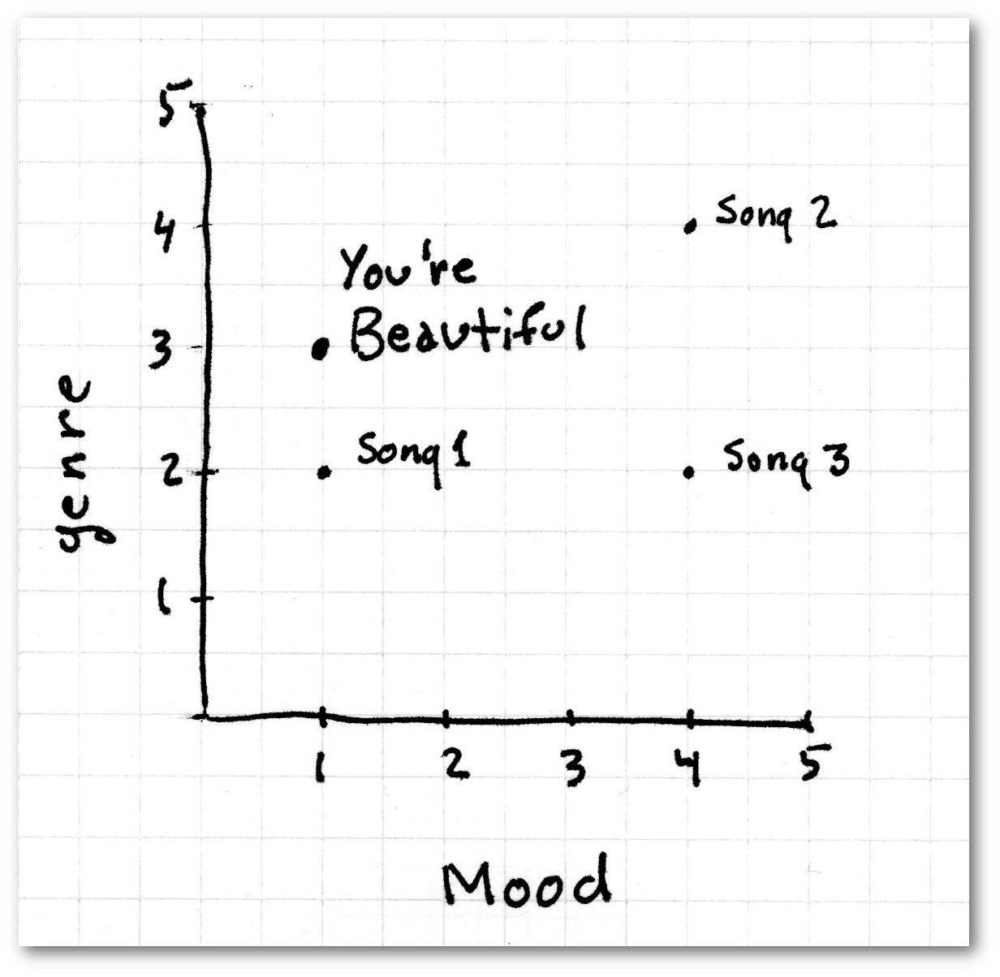
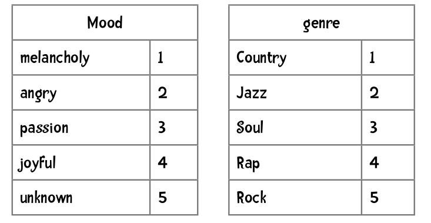
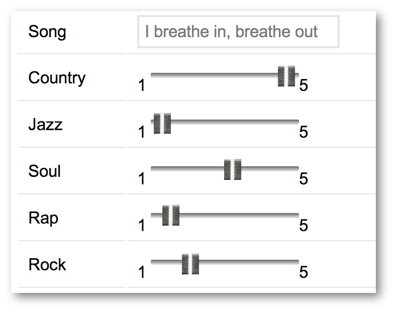

第四章：基于内容的过滤和分类
============

原文链接：http://guidetodatamining.com/chapter-4/

内容：
* 基于事物属性的分类

# 基于事物属性的分类
在之前的章节中，我们讨论了如何使用协同过滤（亦称社会过滤）的方法来给出推荐结果。在协同过滤中，我们利用社区中人们的力量来帮助我们做推荐。比如你买了专辑[Wolfgang Amadeus Phoenix](http://en.wikipedia.org/wiki/Wolfgang_Amadeus_Phoenix)。我们发现，很多买了这张专辑的顾客也买了Vampire Weekend的Contra专辑。所以，我们就将Vampire Weekend的这张专辑推荐给你。我看了美剧*[神秘博士](http://movie.douban.com/subject/1763834/)*，之后[Netflix](http://netflix.com/)就给我推荐了*[量子跳跃](http://movie.douban.com/subject/2073766/)*，因为很多看了*神秘博士*的人也看了*量子跳跃*。在前几章中，我们讨论了一些应用协同过滤可能会遇到的困难，包括数据稀疏性以及可扩展性问题。另外一个问题就是，基于协同过滤的推荐系统倾向于推荐那些已经很流行的物品--即对于流行度有偏好。举一个比较极端的例子，考虑一个新乐队的首张专辑。因为这个乐队和这张专辑从来没有被任何人评分（或者没有任何人购买它，因为他们是全新的），它就永远不会被推荐。

> 对于那些流行的商品来说，这些推荐系统造成了一种“富人更富”效应，对于那些不流行的商品也是如此。
> -- Daniel Fleder and Kartik Hosanagar, 2009年，“Blockbusters Culture's Next Rise or Fall: The Impact of Recommender Systems on Sales Diversity”，Management Science, 第55卷。

在本章中，我们来看一种不同的方法。考虑音乐流媒体服务网站，[Pandora](http://www.pandora.com/)。在Pandora上，就如同你们所知道的那样，你可以建立不同的音乐电台。你在为每个电台设定一个*种子*音乐家之后，Pandora会为你播放与这个音乐家风格相近的音乐。比如，我可以创建一个以Phoenix乐队为种子的电台。之后，Pandora就会播放与Phoenix乐队风格相近的歌曲--比如，它会播放El Ten Eleven乐队的歌曲。Pandora并不是根据协同过滤的思想来做这件事--因为听过Phoenix的人也听过El Ten Eleven。它之所以会播放El Ten Eleven的歌曲是因为El Ten Eleven和Phoenix在音乐风格上很接近。实际上，我们可以问问Pandora为什么播放某个类型的歌曲：

Pandora在Phoenix电台上为我播放的是El Ten Eleven的*My Only Swearing*，因为“根据您之前告诉我们的，我们为您播放这首歌是因为它具有melodic phrasing, mixed acoustic and electric instrumentation, major key tonality, electric guitar riffs and an instrumental arrangement的特点（HELP!）”。在我的Hiromi电台，Pandora播放的是E.S.T.的歌曲，因为“它具有classic jazz roots, a well-articulated piano solo, light drumming, an interesting song structure and interesting part writing”。
<!--melodic phrasing, mixed acoustic and electric instrumentation, major key tonality, electric guitar riffs and an instrumental arrangement 的翻译-->

Pandora的推荐系统基于所谓的*音乐基因组计划（The Music Genome Project）*。他们雇佣那些在音乐理论领域具有强大背景的专业人士作为分析员，是这些人确定了一首歌的特征（他们称作“音乐基因”）。这些分析员接受了150小时的训练。在训练结束后，他们需要平均20～30分钟的时间来分析一首歌的基因（或者特征）。很多音乐基因具有很强的专业性。

这些分析员为超过400多个基因提供数据。这个过程需要大量的人力，平均每个月大约有15,000首歌曲被添加到音乐库中。

> 注意：Pandora的算法是私有的，我完全不知道它是如何工作的。接下来的内容并不是描述Pandora如何做的，而是作为一个如何构建一个与Pandora相似的系统的介绍。

# 选择合适的数值的重要性

考虑以下两个Pandora可能使用的基因：类型（genre）和情感（mood）。这两种基因的可能取值如下所示：

<!--
<table border="1">
    <tr> <th colspan="2">genre</th> </tr>
    <tr> <td>Country</td> <td>1</td> </tr>
    <tr> <td>Jazz</td> <td>2</td> </tr>
    <tr> <td>Rock</td> <td>3</td> </tr>
    <tr> <td>Soul</td> <td>4</td> </tr>
    <tr> <td>Rap</td> <td>5</td> </tr>
</table>

<table border="1">
    <tr> <th colspan="2">mood</th> </tr>
    <tr> <td>Melancholy</td> <td>1</td> </tr>
    <tr> <td>joyful</td> <td>2</td> </tr>
    <tr> <td>passion</td> <td>3</td> </tr>
    <tr> <td>angry</td> <td>4</td> </tr>
    <tr> <td>unknown</td> <td>5</td> </tr>
</table>
-->

> Country意为乡村音乐，Jazz意为爵士乐，Rokc意为摇滚乐，Soul意为灵魂歌曲，Rap意为说唱歌曲。读者们可以自行查阅表格中其他单词的含义，在这里我们并不翻译表格中的单词，并且在下文中直接使用英语单词指带。-- 译者注。

所以，genre取值为4含义为"Soul"，mood取值为3的含义为“passion”。假如我有一首rock歌曲，并且还有些悲伤（melancholy）--比如James Blunt那首令人反胃的*You are beautiful*。在二维空间中，很快地将其画在纸上可能会是这样：

> 事实：在Rolling Stone的一个关于史上最令人厌恶的歌曲的调查问卷当中，*You are beautiful*排名第7！（*My Heart will go on*排名第4！详见[这里](http://www.rollingstone.com/music/blogs/staff-blog/the-20-most-annoying-songs-20070702) -- 译者注）

比如说Tex就是非常喜欢*You are beautiful*，我们希望为他推荐一首歌。

现在让我往我们的数据集中添加一些歌曲。歌曲1是首Jazz，并且有些忧伤（melancholy）；歌曲2是首Soul，有些愤怒（angry）；歌曲3是首Jazz，而且有些愤怒（angry）。你会将哪首歌推荐给Tex呢？

我希望你已经看出来我们的方案存在着致命的缺陷。让我们再来看看变量可能取到的数值。

如果我们在这个方案里尝试使用任何的距离计算方法，我们其实承认了：Jazz与Rock距离要比它与Soul的距离近（Jazz与Rock的距离是1，而Jazz与Soul的距离为2）。或者说，melancholy与joyful的距离要比它与angry的距离更近。即便我们重新分配数值，我们仍然无法避免这个问题。

重新排序并不能这个问题。无论我们如何重新分配数值，问题依然会存在。这说明，我们选择的特征很差。我们希望特征的取值能够在一个有意义的数值范围中。我们可以很容易的将上面的“genre”特征分成5个特征，分别是“country”、“jazz”等等。

这些特征的取值在1～5之间，例如“Country”表示这首歌具有多少“Country”的特点--取值为“1”表示这首歌一点都不像“Country”，而取值为“5”表示这首歌绝对是一首“Country”。现在这里的取值范围确实具有了含义。如果我们现在需要找到一首歌，它的“Country”特征的取值为5，还有另外两首歌，其“Country”的特征取值分别为4和1，那么，“Country”取值为4的歌曲就更符合我们的要求。

这就是Pandora如何建立它的音乐基因库的。大多数的基因取值在1～5之间，并以0.5为步长。音乐基因还被分配到类别中。比如，其中有一个乐感分类包括四种基因，分别是Blue Rock Qualities, Folk Rock Qualities, Pop Rock Qualities等。另外一个类别关于乐器的音乐基因，比如手风琴，Dirty Electric Guitar Riffs和Use of Dirty Sounding Organs。利用这些基因--它们都是定义良好的，而且取值范围都是1～5之间，Pandora用一个长度为400的数值向量来表示一首歌（每首歌是在400维空间中的一个点）。现在，Pandora可以基于标准的距离测量函数来为人们推荐歌曲了（即，跟绝用户定义的电台决定播放哪些歌曲），而这些距离函数是我们之前见到的那些。

## 一个简单的例子

